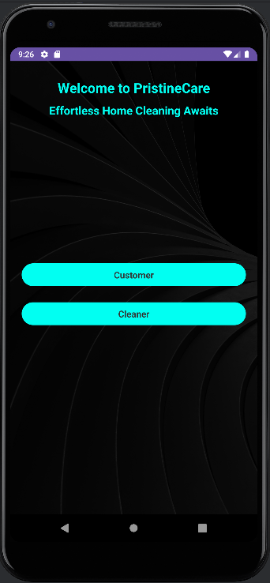

# 🧼 PristineCare – House Cleaning Android Application

**PristineCare** is a feature-rich Android application built with a modern UI and **Firebase** backend. It allows customers to request professional house cleaning services and enables cleaners to manage and accept cleaning jobs. The system supports authentication, session management, billing, job tracking, and reviews.

---

## 🚀 Features

### 👥 User Roles:
- **Customer:**
  - Register and log in.
  - Add house details.
  - Select cleaning type and view calculated bill.
  - Submit cleaning requests.
  - View accepted jobs and cleaner details.
  - Submit and view reviews after job completion.

- **Cleaner:**
  - Register and log in.
  - View all available cleaning jobs.
  - Accept jobs with status tracking (Scheduled, Completed, Declined).
  - View reviews from customers.

### 🔐 Authentication & Session Management
- Firebase Authentication is used for secure login and registration.
- SessionManager maintains active login sessions for both user types.

### 📋 Billing System
- Automatic price calculation based on:
  - Number of rooms and bathrooms.
  - Flooring type.
  - Selected cleaning type.

### ⭐ Review System
- Customers can submit reviews after job completion.
- Cleaners can view reviews on their profile.

---

## 🧰 Technologies Used

### 🖼️ Frontend
- **Java** – Core application logic
- **XML** – UI design with ConstraintLayout and ScrollView

### ☁️ Backend
- **Firebase Realtime Database** – Stores users, houses, jobs, and reviews
- **Firebase Authentication** – Manages user login and registration

---

## 📲 Installation & Setup

1. **Clone the repository**:
   ```bash
   git clone https://github.com/Kalana-S/PristineCare-App.git

2. Open the project in Android Studio.

3. Add your own Firebase configuration:
   - Add your own `google-services.json` file inside the `app/` folder.
   - Do **NOT** commit this file to GitHub.

4. Build & Run the app on an emulator or physical device.

---

## ✅ Usage Guide

1. Customers must register or log in.
2. Add house details and choose cleaning options.
3. View bill and confirm cleaning job request.
4. Cleaners log in and accept jobs with appropriate status.
5. Customers can review the service after completion.
6. All interactions are saved and synced via Firebase.

---

## 📸 Screenshots



---

## ⚠️ Firebase & Security Notes

`google-services.json` is NOT included in this repo for security reasons.

Make sure to secure your Firebase Realtime Database with proper rules:

```json
{
  "rules": {
    ".read": "auth != null",
    ".write": "auth != null"
  }
}

```

---

## 🤝 Contribution

Contributions are welcome! If you'd like to improve the project, feel free to fork the repository and submit a pull request.

## 📜 License

This project is open-source and available under the **MIT License**.

---

💡 *Developed with care using Firebase, Java, and Android Studio*


